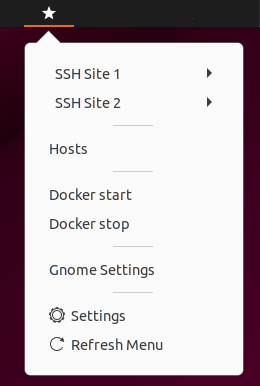

### Deprecated: does not work on Ubuntu 24.04 and later. Instead you can use this extension: [https://gitlab.com/astrapi-os/shell-extensions/panel-menu](https://github.com/tmarly/gnome-extension-panel-menu) 

Launcher Gnome Extension
========================

Display a menu in order to launch / execute applications, open ssh connections, etc...

This is an adaptation of SSHPlus from Anil Gulecha.



Note: Works on Ubuntu 20.04 and 22.04

Installation
------------

Get the source code:

    git clone https://github.com/tmarly/gnome-extension-launcher.git
    cp -r gnome-extension-launcher/gnome-launcher@tmarly.github.com ~/.local/share/gnome-shell/extensions/

Restart the gnome shell: press Alt+F2 and type `r` then hit **enter**.

Theb enable it

    gnome-extensions enable gnome-launcher@tmarly.github.com

Configuration
-------------

In the menu, click on 'settings', it will open the file ~/.gnome-launcher.cfg

Edit and save this file (cf. example below), then in the menu, click on 'Refresh Menu'.

Config example:

```
# ====  Folder SSH ====
folder:SSH Site 1

Server 1|ssh user@myip.com
Server 2|ssh user@myip.com

sep

Server 3|ssh user@myip.com

folder:

# ====  Folder SSH ====
folder:SSH Site 2

Server 1|ssh user@myip.com
Server 2|ssh user@myip.com

folder:

# ==== Custom actions ====

sep 

Hosts|sudo subl /etc/hosts

sep

Docker start|docker-compose -f ~/project/docker-compose.yml start
Docker stop|docker-compose -f ~/project/docker-compose.yml stop

sep

Gnome Settings|gnome-control-center

```
